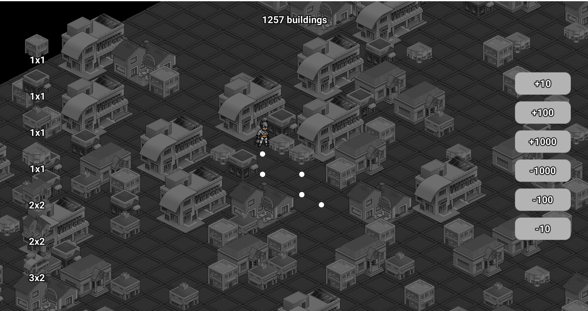

# Test task "City Builder"

### Features:

- Place buildings of different sizes
- Destroy buildings by click
- Bulk destroy and create buildings
- A\* player navigation
- Ability to add up to 5000 buildings at a time
- Good performance

### Dependencies

- https://github.com/britzl/defold-orthographic/archive/master.zip
- https://github.com/Insality/druid/archive/refs/tags/1.0.zip
- https://github.com/selimanac/defold-astar/archive/master.zip

#### Boot collection: main.collection

